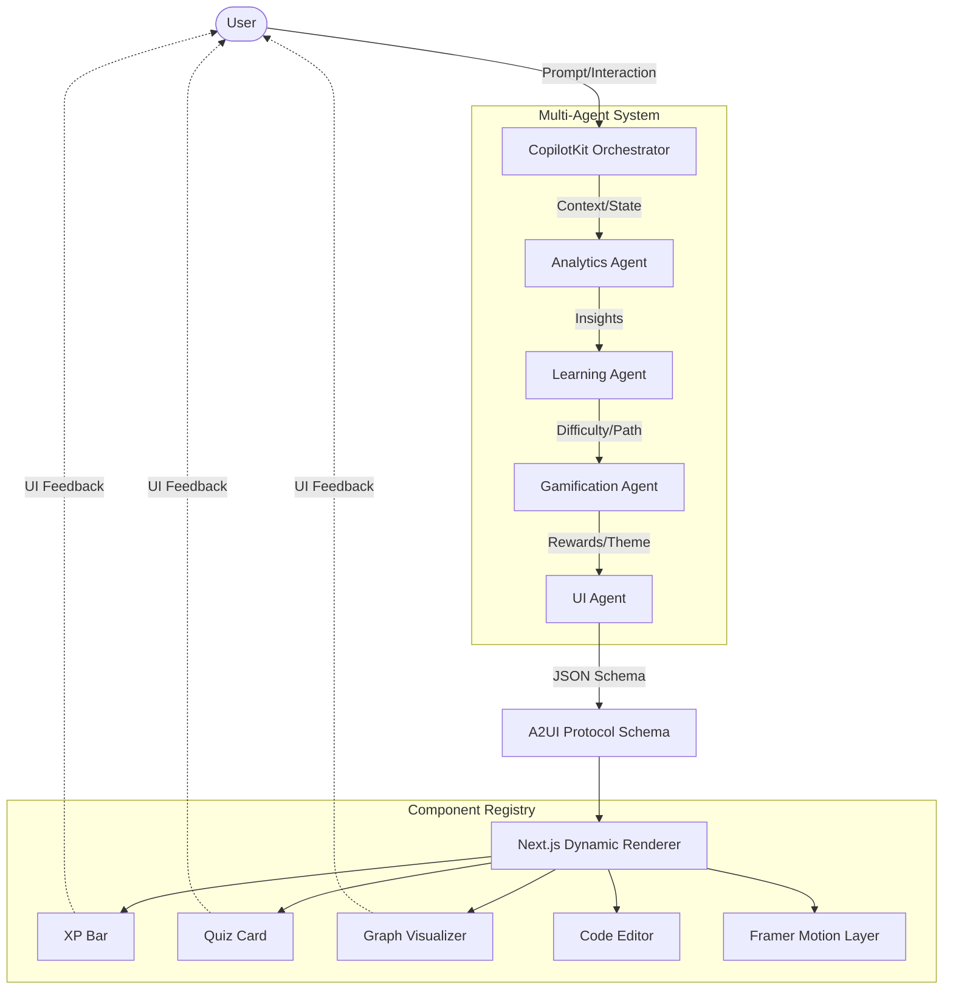

# NeuroPlay AI - Detailed Implementation Plan

This document outlines the end-to-end implementation plan for **NeuroPlay AI**, an adaptive, gamified learning workspace where AI agents dynamically generate interfaces at runtime.

## 1. System Architecture

The core philosophy of NeuroPlay AI is **Data-Driven UI Generation**. The frontend does not have hardcoded learning screens. Instead, it has a single dynamic renderer that interprets A2UI JSON schemas generated by the multi-agent system.



## 2. Tech Stack & Initial Setup

*   **Framework:** Next.js (App Router)
*   **Styling:** Tailwind CSS + standard modern design tokens (glassmorphism, neon glows)
*   **Animations:** Framer Motion (essential for the "wow factor")
*   **AI Infrastructure:** CopilotKit (for state sync and agent coordination) + Gemini 2.5 Flash
*   **UI Protocol:** A2UI (Agent-to-UI JSON schema definition)

### Project Initialization Commands
```bash
npx -y create-next-app@latest ./ --typescript --tailwind --eslint --app
npm install framer-motion @copilotkit/react-core @copilotkit/react-ui @copilotkit/backend
npm install @google/generative-ai lucide-react clsx tailwind-merge
```

## 3. Directory Structure

```text
/app
  /api/copilotkit/route.ts  # Backend Copilot endpoint
  /page.tsx                 # Main application entry point
/components
  /registry                 # All dynamic components (XPBar, CodeEditor, etc.)
  /DynamicRenderer.tsx      # The A2UI Schema interpreter
  /ThemedContainer.tsx      # Handles visual themes (Cyberpunk, Space, etc.)
/agents
  /uiAgent.ts
  /learningAgent.ts
  /gamificationAgent.ts
  /analyticsAgent.ts
/lib
  /a2ui-schema.ts           # Zod or TS interfaces for the A2UI JSON structure
/store
  /appState.ts              # Global state (user level, current topic)
```

## 4. Phase-by-Phase Development

### Phase 1: Foundation & A2UI Protocol (Day 1 - Morning)
**Goal:** Build the engine that turns JSON into interactive React components.

1.  **Define A2UI Types:** Create the TypeScript interfaces for the JSON schema.
    ```typescript
    interface A2UISchema {
      theme: 'cyberpunk' | 'space' | 'fantasy' | 'minimal';
      layout: 'split' | 'grid' | 'focused';
      components: ComponentSchema[];
    }
    ```
2.  **Build the Component Registry:** Create dummy versions of all required components (`XPBar`, `QuizCard`, `GraphVisualizer`).
3.  **Implement `DynamicRenderer.tsx`:** A component that takes an `A2UISchema` object and maps `component.type` to the actual React component from the registry.
4.  **Test the Renderer:** Hardcode a few JSON schemas to verify that the UI renders and transitions correctly using Framer Motion.

### Phase 2: Agent Architecture & CopilotKit (Day 1 - Afternoon)
**Goal:** Set up the backend intelligence and agent orchestration.

1.  **CopilotKit Integration:** Wrap the Next.js app in `<CopilotKit>` and setup the backend API route.
2.  **Define the Agents (Prompts & Tools):**
    *   **UI Agent:** Prompted to output strict A2UI JSON based on the current context.
    *   **Learning Agent:** Uses Gemini 2.5 Flash to analyze the user's prompt (e.g., "Teach me binary search") and break it down into a learning plan.
    *   **Gamification Agent:** Monitors events and dispatches tools like `awardXP(amount, reason)` or `triggerBossBattle()`.
3.  **State Sync:** Use `useCopilotReadable` to expose the frontend state (user interactions, current screen) to the backend agents.

### Phase 3: Interactive Components & "Wow Factor" (Day 2 - Morning)
**Goal:** Make the UI feel like a premium game, not a dashboard.

1.  **Framer Motion Integration:** Add `layoutId` and `AnimatePresence` to the `DynamicRenderer` so when the A2UI schema changes, components smoothly glide into their new positions or fade in/out.
2.  **Implement Complex Components:**
    *   **Node Manipulator:** A draggable graph component for visual learning.
    *   **Code Playground:** A simple Monaco or basic text area with syntax highlighting.
3.  **Theme System:** Implement the CSS variables for the themes (`cyber-learning`, `space-academy`). When the UI Agent changes the `theme` field in the schema, the entire app's color palette and background should morph.

### Phase 4: The Feedback Loop (Day 2 - Afternoon)
**Goal:** Achieve "True Agentic UI" where the interface adapts to the user.

1.  **Interaction Tracking:** When a user interacts with a component (e.g., fails a quiz, drags the wrong node), fire an action to CopilotKit.
2.  **Analytics Agent:** Processes the interaction event. If the user is struggling, it signals the Learning Agent.
3.  **Live Re-generation:** The Learning Agent requests a simpler explanation, causing the UI Agent to generate a *new* A2UI schema. The frontend receives the new schema and seamlessly morphs the UI to show hints or a slower animation.

### Phase 5: Polish & Demo Preparation (Day 3)
**Goal:** Ensure the system looks incredible for the judges.

1.  **Demo Script Hardening:** Choose a specific, visually impressive path for the demo (e.g., "Teach me Dijkstra's Algorithm in a Space Theme").
2.  **Edge Cases:** Ensure the JSON parsing doesn't crash the frontend if the LLM hallucinates (add fallback error boundaries).
3.  **Micro-animations:** Add particle effects for leveling up, glowing borders for streaks.

## 5. The Component Registry Example

This is the most critical pattern in your frontend codebase:

```tsx
import { XPBar, QuizCard, CodeEditor, GraphVisualizer } from './components';

const registry = {
  xp_bar: XPBar,
  quiz_card: QuizCard,
  code_editor: CodeEditor,
  graph_visualizer: GraphVisualizer,
};

export function DynamicRenderer({ schema }) {
  return (
    <div className={`theme-${schema.theme} layout-${schema.layout}`}>
      {schema.components.map((item, index) => {
        const Component = registry[item.type];
        if (!Component) return null;
        
        return (
          <Component 
            key={index} 
            data={item.data} 
            onInteract={(event) => handleInteraction(item.id, event)} 
          />
        );
      })}
    </div>
  );
}
```

## 6. Demo Narrative (For the Hackathon Pitch)

When presenting, emphasize the architectural shift:

1.  **The Hook:** "Standard learning platforms use static dashboards. We built an AI that *designs* the learning software at runtime."
2.  **The Architecture:** Briefly show the multi-agent system slide. "Our Gamification Agent decides you need a reward, and our UI agent literally writes the JSON schema to render the XP bar on the fly."
3.  **The Demo:**
    *   *Action:* Type "Teach me Binary Search".
    *   *Visual:* The screen morphs into a 'Cyber-Learning' theme with an array visualizer.
    *   *Action:* Purposely fail the interaction.
    *   *Visual:* The UI dynamically updates—removing the hard code editor and replacing it with an animated conceptual diagram.
4.  **The Conclusion:** "This isn't a chatbot. This is a generative interactive world."